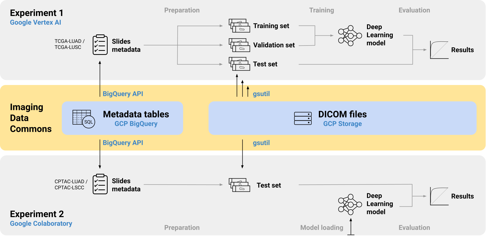

# Classification of lung tumor slide images with the NCI Imaging Data Commons

This repository contains the source code of the experiments performed in the publication [**The NCI Imaging Data Commons as a platform for reproducible research in computational pathology**](https://doi.org/10.1016/j.cmpb.2023.107839), which investigates how the [Imaging Data Commons (IDC)](https://portal.imaging.datacommons.cancer.gov/) can be used to facilitate reproducibility in computational pathology research.

The experiments are based on a representative use case: the AI-based classification of lung tissue regions into either non-neoplastic (normal), adenocarcinoma (LUAD), or squamous cell carcinoma (LSCC) tissue. The first experiment uses the IDC for model training, validation and testing on TCGA data. The second experiment applies a pre-trained model from the first experiment to independent data from the CPTAC project. In the publication, the experiments were run multiple times with independent but identically configured sessions of common ML services to assess their reproducibility.

Each experiment is implemented as one Jupyter notebook file: [lung_cancer_experiment_1.ipynb](lung_cancer_experiment_1.ipynb) and [lung_cancer_experiment_2.ipynb](lung_cancer_experiment_2.ipynb). 
Utility code for both experiments is contained in the package [idc_comppath_reproducibility](idc_comppath_reproducibility/) and can be re-used for similar computational pathology use cases with the IDC. Further information on how to run the experiments can be found in the respective notebook files.

**Note:** Earlier versions of the Jupyter notebooks and source code used in the preprint of the publication can be found in the ["preprint" branch](
https://github.com/ImagingDataCommons/idc-comppath-reproducibility/tree/preprint).